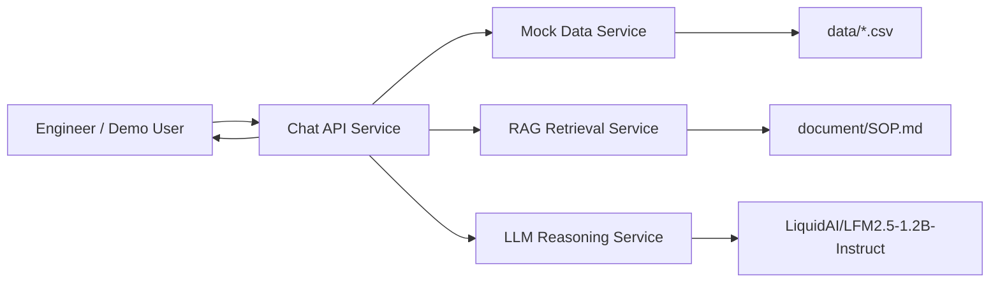
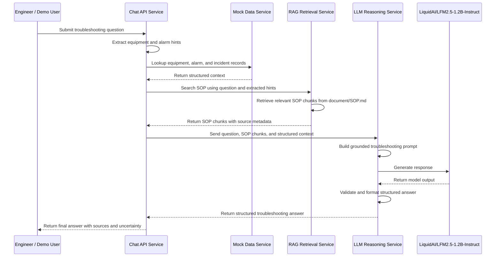

# Technical Design: Manufacturing Equipment Repair Engineer Chatbot

## 1. Purpose

This project implements a small agentic RAG chatbot for manufacturing equipment repair engineers. The chatbot answers troubleshooting questions by retrieving relevant SOP sections from `document/SOP.md`, enriching the request with structured mock data from `data/`, and using `LiquidAI/LFM2.5-1.2B-Instruct` to generate a grounded, structured response.

The system is designed as a simple FastAPI microservice demo. Each service has one clear responsibility, communicates over HTTP, and exposes its own Swagger documentation for review and testing.

## 2. Goals

- Accept free-text troubleshooting questions from repair engineers.
- Retrieve relevant SOP context before generating answers.
- Use structured equipment, alarm, and incident data to enrich the response.
- Use `LiquidAI/LFM2.5-1.2B-Instruct` as the reasoning model.
- Return structured responses with issue summary, SOP context, recommended checks, safety precautions, escalation criteria, and uncertainty.
- Handle unknown equipment, unknown alarms, missing SOP context, and failed LLM calls gracefully.
- Run the demo as separate FastAPI services, preferably through Docker Compose.

## 3. High-Level Architecture

### 3.1 Architecture Overview

### 3.2 Service Responsibilities

| Service | Responsibility | Suggested Port |
| --- | --- | --- |
| Chat API Service | Public entry point. Coordinates data lookup, SOP retrieval, LLM reasoning, and response shaping. | `8000` |
| RAG Retrieval Service | Loads, chunks, indexes, and searches SOP content from `document/SOP.md`. | `8001` |
| LLM Reasoning Service | Builds grounded prompts, calls `LiquidAI/LFM2.5-1.2B-Instruct`, and validates response structure. | `8002` |
| Mock Data Service | Serves equipment, alarm, and incident records from CSV files in `data/`. | `8003` |

The Chat API Service is the orchestration layer. It receives the engineer's question, gathers context from the RAG Retrieval Service and Mock Data Service, then sends the grounded context to the LLM Reasoning Service. The final answer is returned with source references and uncertainty notes.

### 3.3 Runtime Sequence

## 4. Known Limitations

- Mock data is static and does not represent live factory systems.
- Retrieval confidence is limited by the small SOP corpus.
- No persistent conversation state is included.
- No production authentication or authorization is included.
- No human approval workflow is implemented for safety-critical recommendations.
- LLM output quality depends on provider availability and model behavior.
