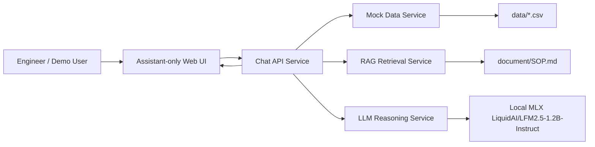
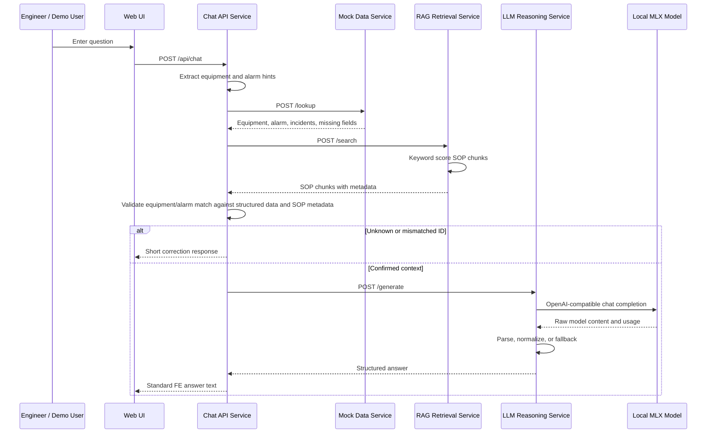

# Technical Design: Manufacturing Equipment Repair Engineer Chatbot

## 1. Purpose

This project implements a small agentic RAG chatbot for manufacturing equipment repair engineers. The chatbot answers troubleshooting questions by retrieving relevant SOP sections from `document/SOP.md`, enriching the request with structured mock data from `data/`, and using a locally deployed MLX instance of `LiquidAI/LFM2.5-1.2B-Instruct` to generate a grounded response.

The system is designed as a FastAPI microservice demo. Each service has a clear responsibility, communicates over HTTP, exposes Swagger documentation, and logs startup/API payloads for demo traceability.

## 2. Goals

- Accept free-text troubleshooting questions from repair engineers.
- Retrieve relevant SOP context before reasoning.
- Enrich answers with equipment, alarm, and incident data from CSV-backed mock services.
- Use `LiquidAI/LFM2.5-1.2B-Instruct` through a local MLX OpenAI-compatible endpoint.
- Return a standard operator-friendly answer format:
  - Action Decision
  - Issue Summary
  - Relevant SOP Context
  - Recommended Checks
  - Likely Causes
  - Recovery / Next Steps
  - Safety Precautions
  - Escalation Criteria
  - Uncertainty / Missing Information
- Return short correction messages when equipment or alarm IDs are not confirmed, for example: `Cannot find alarm type GAS0. Do you mean GAS012?`
- Handle missing SOP context, unknown identifiers, LLM failures, and malformed model output gracefully.
- Provide a simple assistant-only frontend with demo login, sample questions, conversation history, and Enter-to-submit behavior.
- Run as separate FastAPI services through Docker Compose.

## 3. High-Level Architecture

### 3.1 Architecture Overview



### 3.2 Frontend Experience

The frontend is served by the Chat API Service at `GET /`.

Current frontend behavior:

- Shows a simple login page before the assistant.
- Demo credentials are hardcoded in frontend JavaScript:
  - username: `hana`
  - password: `123`
- After login, only the assistant session is rendered.
- SOP navigation and document panels are kept in the source file but commented out for the current demo.
- Sample questions are hidden by default behind a `Sample questions` toggle.
- The question box is blank by default.
- Pressing `Enter` submits the question.
- Pressing `Shift + Enter` inserts a new line.
- Conversation history remains visible during the browser session.
- SOP jump chips/navigation are currently commented out.

This keeps the demo focused on the chatbot behavior while preserving previous UI work for future restoration.

### 3.3 Service Responsibilities

| Service | Responsibility | Port |
| --- | --- | --- |
| Chat API Service | Public entry point, frontend host, orchestration, identifier guardrails, fallback response shaping. | `8000` |
| RAG Retrieval Service | Loads, chunks, indexes, and searches SOP content from `document/SOP.md`. | `8001` |
| LLM Reasoning Service | Builds grounded prompts, calls local MLX LiquidAI model, parses and normalizes structured answers. | `8002` |
| Mock Data Service | Serves equipment, alarm, and incident records from CSV files in `data/`. | `8003` |

### 3.4 Runtime Sequence



### 3.5 Retrieval Logic

The RAG Retrieval Service uses deterministic keyword retrieval rather than embeddings.

At startup:

- `document/SOP.md` is parsed into SOP records.
- Each SOP becomes multiple chunks:
  - `Summary`
  - `Symptoms`
  - `Safety Precautions`
  - `Troubleshooting Steps`
  - `Escalation Criteria`
- Each chunk keeps metadata: `source_id`, `title`, `section`, `equipment`, `alarm_code`, `severity`, and `content`.

Search scoring:

- Token overlap between query/hints and chunk text.
- Exact alarm match boost: `+8.0`.
- Exact equipment match boost: `+4.0`.
- Small section boost for safety, troubleshooting, and escalation sections: `+0.25`.

Because keyword retrieval can return nearby chunks for typo inputs, Chat API validates retrieved metadata before using it as confirmed evidence.

### 3.6 Guardrails

Chat API applies identifier guardrails before calling the LLM:

- If the user provides an alarm code that is not confirmed in mock alarm data, and retrieved SOP chunks point to a different alarm, the response is a short correction message.
- If the user provides an equipment ID that is not confirmed in equipment data, and retrieved SOP chunks point to different equipment, the response is a short correction message.
- In those cases, the LLM is not called and SOP jump chips are not returned as confirmed references.

Examples:

```text
Cannot find alarm type GAS0. Do you mean GAS012?
```

```text
Cannot find equipment ID Etcher-0399. Do you mean Etcher-03?
```

### 3.7 LLM and Fallback Behavior

The LLM Reasoning Service prompts the local LiquidAI model to return JSON matching the structured answer schema. The parser normalizes common model mistakes, including string fields where arrays are expected.

If the LLM provider is unavailable, times out, or returns invalid JSON:

- LLM Reasoning Service uses a deterministic fallback based on retrieved SOP chunks.
- Chat API may also use a deterministic fallback if the LLM Reasoning Service call fails.
- Warnings are returned and logged.
- HTTP client errors include error type and URL, for example `ReadTimeout from http://llm-reasoning:8002/generate`.

### 3.8 Logging

Each service writes JSON-line logs to `logs/` when run with Docker Compose.

Logged events include:

- `service_started`
- `api_call` with request and response payloads
- LLM provider request messages
- raw LLM provider response content and usage
- LLM provider errors

API keys are not logged.

## 4. Known Limitations

- Mock data is static and does not represent live factory systems.
- Retrieval is keyword-based, not vector-based.
- Demo login is hardcoded and not production authentication.
- Conversation history is frontend-session only and is not persisted.
- No human approval workflow is implemented for safety-critical recommendations.
- LLM output quality depends on local MLX model availability and response quality.
- The frontend currently focuses on the assistant session only; SOP navigation is commented out.
